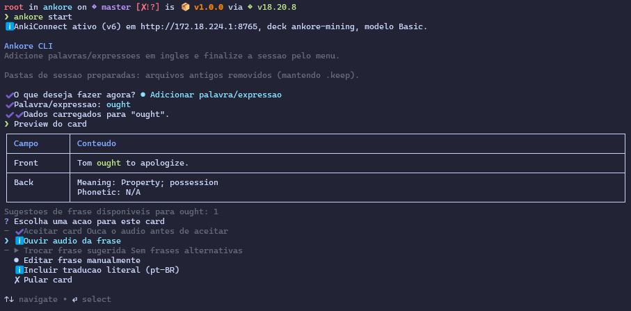

# Ankore CLI

<p align="center">
  
</p>

CLI em Node.js para criar cards de sentence mining com audio e enviar direto para o Anki via AnkiConnect.



## Tecnologias usadas

- Node.js + TypeScript
- Busca de contexto e significado:
  - Reverso Context (`reverso-api`)
  - Dictionary API (`dictionaryapi.dev`)
  - Tatoeba
  - Quotable
- TTS local com Piper + conversao MP3 com ffmpeg
- Integracao com AnkiConnect (deck `ankore-mining`)

## Pre-requisitos

- Node.js 18+
- Anki instalado no Windows/macOS/Linux
- Add-on AnkiConnect ativo no Anki
- Piper e ffmpeg sao opcionais (a CLI tenta resolver automaticamente)

## Instalacao

```bash
make install
```

Alternativa sem Makefile:

```bash
npm install
npm run build
npm link
```

## Como usar (primeiro uso)

Siga esta ordem para evitar erro de conexao com o Anki:

1. Clone o repositorio:

```bash
git clone <URL_DO_REPOSITORIO>
cd ankore
```

2. Instale e prepare a CLI:

```bash
make install
```

3. Abra o Anki e confirme que o add-on AnkiConnect esta instalado e ativo.
4. Se necessario, reinicie o Anki para o AnkiConnect subir corretamente.
5. Com o Anki aberto, valide a conexao:

```bash
ankore doctor
```

6. Inicie o projeto:

```bash
ankore start
```

Observacao: sem o Anki aberto e sem o AnkiConnect ativo, a criacao automatica de notas nao funciona.

## Como rodar

Modo normal:

```bash
ankore start
```

Modo watch (captura do clipboard):

```bash
ankore start --watch
```

Diagnostico do AnkiConnect:

```bash
ankore doctor
```

Ao finalizar a sessao, o arquivo `.tsv` de backup e salvo automaticamente em `session-output/exports/`.

## WSL (pre-uso obrigatorio)

Se voce roda Ankore no WSL e Anki no Windows, configure antes do primeiro uso:

1. No Anki (Windows), abra `Tools > Add-ons > AnkiConnect > Config`.
2. Troque `webBindAddress` de `127.0.0.1` para `0.0.0.0`.
3. Mantenha `webBindPort` como `8765`.
4. Salve e reinicie o Anki.
5. No Windows PowerShell (Administrador), libere a porta `8765`:

```powershell
New-NetFirewallRule `
  -DisplayName "Allow Port 8765" `
  -Direction Inbound `
  -Protocol TCP `
  -LocalPort 8765 `
  -Action Allow
```

6. No WSL, valide com:

```bash
ankore doctor
```

## Variaveis de ambiente principais

- `ANKORE_ANKI_CONNECT_URL`: URL fixa do AnkiConnect (opcional)
- `ANKORE_WSL_HOST_IP`: override manual do IP do host Windows no WSL (opcional)
- `ANKORE_ANKI_MODEL_NAME`: modelo de nota no Anki (default: `Basic`, com fallback automatico para variantes localizadas do modelo basico)
- `ANKORE_ANKI_FRONT_FIELD`: campo de frente no modelo
- `ANKORE_ANKI_BACK_FIELD`: campo de verso no modelo
- `ANKORE_TTS_MODEL`: modelo de voz TTS
- `ANKORE_PIPER_BIN`, `ANKORE_PIPER_MODEL_PATH`, `ANKORE_FFMPEG_BIN`: caminhos customizados para binaries/modelo

## Fluxo com Anki

- Cada card aceito tenta criar nota automaticamente no deck `ankore-mining` com audio.
- Em falha de conectividade do AnkiConnect, o card continua salvo localmente e no `.tsv`.
- Para importacao manual de backup no Anki (`.tsv`):
  - Campo 1 -> Front
  - Campo 2 -> Back
  - Delimitador -> Tab
  - Permitir HTML no Front (`<b>...</b>`)
